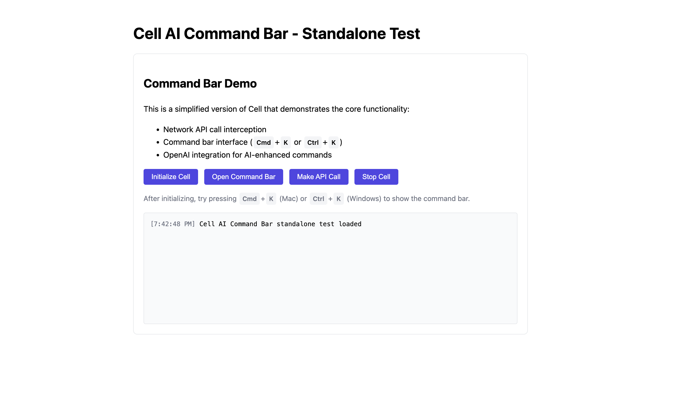

# Cell: AI Command Bar for SaaS Applications



Cell is an embedded AI command bar for SaaS applications that captures network/API calls, predicts user actions, and automates workflows. It provides a friction-free experience similar to Cursor but inside any SaaS product.

## Features

- **API Call Interception**: Captures network requests as users navigate SaaS applications
- **Pattern Recognition**: Analyzes call sequences and predicts next actions
- **Tab Suggestion**: Shows "Press Tab" prompt when prediction confidence is high
- **Command Bar**: Provides natural language interface triggered by Cmd+K/Ctrl+K
- **Workflow Automation**: Detects repetitive patterns and offers to automate them
- **AI Enhancement**: Built-in integration with OpenAI for improved understanding
- **Autocomplete**: Real-time suggestions as you type in the command bar

## Quick Start (Standalone Demo)

1. **Clone this repository**
2. **Add your OpenAI API key**:
   - Copy `config.sample.js` to `config.js`
   - Add your OpenAI API key to the copied file
   - _Keep your API key private - do not commit it to public repositories_

   ```javascript
   // config.js
   window.CELL_CONFIG = {
     openai: {
       apiKey: 'YOUR_OPENAI_API_KEY_HERE',
       model: 'gpt-4o-mini'
     },
     app: {
       id: 'standalone-test',
       suggestionThreshold: 0.6
     }
   };
   ```

3. **Run a local server** (from the project directory):
   ```bash
   python3 -m http.server 8080
   ```

4. **Open the demo** in your browser:
   - Go to [http://localhost:8080/standalone-test.html](http://localhost:8080/standalone-test.html)

5. **Try the features**:
   - Click "Initialize Cell" to start
   - Use Cmd+K (Mac) or Ctrl+K (Windows) to open the command bar
   - Try commands like `make api call`, `record workflow`, `stop recording`, `run workflow`, or use natural language
   - Repeated actions will trigger automation suggestions
   - Use Tab to accept suggested next actions

## Files

- `standalone-cell.js` — Main implementation (no dependencies)
- `standalone-test.html` — Demo page for testing Cell
- `config.sample.js` — Sample config (copy to `config.js` and add your OpenAI API key)

## Security Note

Never commit your OpenAI API key to version control. Always use environment variables or a local configuration file that is listed in `.gitignore`.

## Demo Video

Watch the demo video to see Cell in action: [Cell AI Command Bar Demo](https://youtu.be/mQCxmZyvOfQ)

## License

MIT 